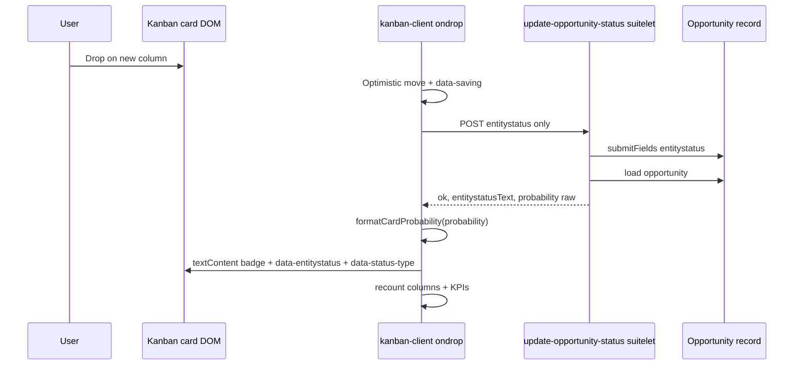

> **Superseded (2026-06-02):** Shipped behavior differs from the technical decisions below (`formatCardProbability`, raw `getValue` on the suitelet). Canonical write-up: [Kanban probability blank on initial portlet load](../solutions/ui-bugs/kanban-probability-initial-load-2026-06-01.md). Merged in PR #2 to `main`.

## Summary

After drag-and-drop saves a new opportunity status, the kanban card should show the **current opportunity probability** from NetSuite, using the **same display rule** as initial board render. The portlet must not invent a new format (e.g. coercing `90.0` to `90%` only). Status-only saves stay status-only on the server; the UI may refresh probability when the suitelet returns the post-save field value.

## Problem Frame

Drag-and-drop already persists `entitystatus` and moves the card. Users expect the probability badge to reflect the opportunity record after the move, matching what they see when opening the record.

An earlier fix attempt updated `.kanban-card-probability` with `String(d.probability) + '%'`, which:

- Dropped decimal precision (`90.0%` → `90%`)
- Did not match how cards are built on load (`(opp.probability || '0') + '%'` in `createCard`)

A follow-up revert stopped updating probability entirely and only synced `data-entitystatus` / `data-status-type`. That fixed the formatting regression but left the original gap: **badge stale after drag** when the record’s probability did change.

NetSuite’s record UI may show `%90.0`; the portlet’s convention is **raw search/suitelet value + suffix `%`** (e.g. `90.0%`, `100.0%`). The plan preserves that portlet convention everywhere—initial render and post-drag refresh—not NetSuite’s label prefix order.

## Requirements

- R1. On successful status save via drag-and-drop, update the card’s probability badge to reflect the opportunity’s probability **after** save when the suitelet includes it in the JSON response.
- R2. Post-drag probability display must use the **identical formatting rule** as `createCard` (single definition or provably equivalent logic)—no second formatter.
- R3. Continue to update status-related card state on success: `data-entitystatus`, `data-status-type`, column counts, KPIs (existing behavior on branch `fix/kanban-probability-on-drag`).
- R4. Do not write or coerce `probability` on the opportunity in the update suitelet; only `entitystatus` is submitted (see origin: user clarification).
- R5. Inline `ondrop` handlers remain quote-safe (single quotes only; no double quotes in generated attribute strings).

## Key Technical Decisions

- KTD1. **Display rule:** Introduce `formatCardProbability(raw)` in `kanban-client.js`: if `raw` is null/empty, `'0%'`; else `String(raw) + '%'`. `createCard` calls this helper instead of inline concatenation. **Rationale:** One rule for load and post-drag; matches current search payloads (`50`, `90.0`, `100`).
- KTD2. **Inline handler constraint:** `makeDropOnclick` cannot call `window.*` (existing tests and portlet extraction patterns forbid it). Embed the **same expression** as `formatCardProbability` inside the generated `ondrop` string, and add a unit test that the embedded snippet stays in sync with the helper (or test the helper and assert the snippet’s logical equivalent). **Rationale:** Proven pattern for `recountVisibleKpis()` and other drop-side effects.
- KTD3. **Suitelet contract:** Restore `probability` on all successful JSON responses (post-`submitFields` reload and no-op same-status path) as the **raw** `getValue({ fieldId: 'probability' })`—no rounding or string manipulation server-side. **Rationale:** Client owns display; server owns truth.
- KTD4. **When not to update DOM:** If `d.probability` is null/undefined on an otherwise successful response, leave the badge unchanged (defensive). **Rationale:** Avoid blanking the badge on partial responses.
- KTD5. **NetSuite semantics:** If changing `entitystatus` does not change the opportunity `probability` field (common when probability is manually set or not tied to status), the badge correctly shows the **saved** value (e.g. 90% in Closed Won), not a column default. **Rationale:** “Use the opp field as intended”; not the kanban’s job to apply status-default probability.

## High-Level Technical Design

## Scope Boundaries

**In scope**

- Shared formatter + `createCard` + `makeDropOnclick` success path
- Suitelet response includes raw `probability`
- Jest coverage for formatter parity and post-drop badge update (including `90.0` → `90.0%`)
- TD deploy → manual portlet test → merge PR #2

**Out of scope**

- Changing how NetSuite sets probability when status changes
- Matching NetSuite form label order (`%90.0` vs `90.0%`)
- Full portlet refresh after every drag
- Setting probability in `submitFields`

### Deferred to Follow-Up Work

- Auto-sync probability to status default when product wants “column implies %” regardless of record field (would need explicit product decision and likely server-side or workflow change)

## Implementation Units

### U1. Shared probability display helper

**Goal:** Single formatting rule for all card probability text.

**Requirements:** R2

**Dependencies:** None

**Files:**

- `src/FileCabinet/SuiteApps/com.netsuite.opportunitykanban/portlet/kanban-client.js`
- `__tests__/kanban-client.test.js`

**Approach:** Add `formatCardProbability(raw)` next to other format helpers; use it in `createCard` for `.kanban-card-probability`.

**Patterns to follow:** `formatCurrency`, `formatCount` in the same utilities section.

**Test scenarios:**

- Happy path: `formatCardProbability('50')` → `50%`; `formatCardProbability('90.0')` → `90.0%`; `formatCardProbability('100')` → `100%`
- Edge: null/undefined/'' → `0%`
- Regression: existing “shows probability percentage” test still passes

**Verification:** Unit tests green; initial board render unchanged for sample data.

---

### U2. Suitelet returns raw probability after save

**Goal:** Client can refresh badge from authoritative post-save value.

**Requirements:** R1, R4

**Dependencies:** None

**Files:**

- `src/FileCabinet/SuiteApps/com.netsuite.opportunitykanban/suitelet/update-opportunity-status.js`
- `__tests__/suitelet/update-opportunity-status.test.js`

**Approach:** On `ok` responses, include `probability: updated.getValue({ fieldId: 'probability' })` (and same for no-op same-status branch). No change to `submitFields` values.

**Test scenarios:**

- Happy path: successful status change response includes `probability` from reloaded record mock
- Edge: same-status no-op still returns `probability` for parity
- Negative: error responses do not include misleading `probability`

**Verification:** Suitelet unit tests pass.

---

### U3. Post-drop card update (status + probability)

**Goal:** Successful drop updates status attributes, KPI inputs, and probability badge without format drift.

**Requirements:** R1, R2, R3, R5

**Dependencies:** U1, U2

**Files:**

- `src/FileCabinet/SuiteApps/com.netsuite.opportunitykanban/portlet/kanban-client.js`
- `__tests__/kanban-client.test.js`
- `__tests__/portlet/kanban-dnd-handlers.test.js`

**Approach:** In `makeDropOnclick` success branch, after `data-entitystatus` / `data-status-type`, set probability badge using embedded logic equivalent to `formatCardProbability(d.probability)` when `d.probability != null`. Keep `recountVisibleColumnCounts()` and `recountVisibleKpis()`.

**Technical design (directional):** Embedded snippet mirrors helper, e.g. compute `pd` from `d.probability` with null/empty → `0%`, else `String(pv)+'%'`, then `prEl.textContent=pd`.

**Patterns to follow:** Existing success-path attribute updates in `makeDropOnclick`; quote-safe handler tests in `kanban-dnd-handlers.test.js`.

**Test scenarios:**

- Happy path: mock fetch `{ ok: true, entitystatusText: 'Closed Won', probability: '100' }` → badge `100%`, `data-status-type` `won`, `data-entitystatus` target id
- Format: mock `probability: '90.0'` → badge `90.0%` (not `90%`)
- Unchanged: when fetch omits `probability`, badge text unchanged
- Quote-safe: `ondrop` attribute contains probability update logic, no `"` characters, parses via `new Function`
- Integration: drag does not call `window.`

**Verification:** `npm test`; manual TD check dragging Purchasing → Closed Won on OPP104 and a card that gains probability on status change.

---

### U4. Ship and validate on TD

**Goal:** Validate in account before merging PR #2.

**Requirements:** R1–R5

**Dependencies:** U1–U3

**Files:** None (deploy + process)

**Approach:** Deploy branch to TD3061543; hard-refresh portlet; test drag across columns with different status-linked probabilities; confirm record vs badge alignment.

**Test expectation:** none — manual account verification

**Verification:** User sign-off; merge `fix/kanban-probability-on-drag`; update PR title/body to reflect “refresh with preserved format” not “probability on drag only”.

## Risks and Dependencies

- **Stale badge vs user expectation:** If users expect Closed Won to always show 100% but the record still has 90%, the UI is correct per R4/KTD5—document in PR test plan; avoid “fixing” in the portlet without product approval.
- **Inline drift:** Embedded formatter in `makeDropOnclick` could diverge from `formatCardProbability`—mitigate with explicit test coupling both paths.
- **PR #2 history:** Branch currently omits probability update; implement U1–U3 on that branch (replace revert intent).

## Sources and Research

- Current `createCard` probability: `(opp.probability || '0') + '%'` in `kanban-client.js`
- Drop success path (status only): `makeDropOnclick` ~lines 272–281
- Opportunity search field: `queries.js` `probability: result.getValue({ name: 'probability' })`
- Portlet constraint: external `kanban-client.js` + inline handlers; no `window.` in `ondrop` (see `__tests__/portlet/kanban-dnd-handlers.test.js`)
